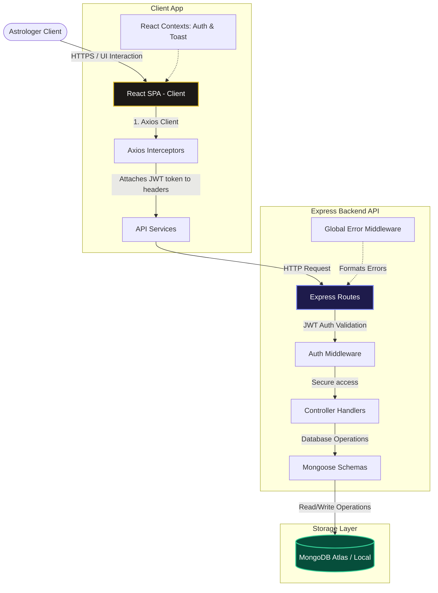
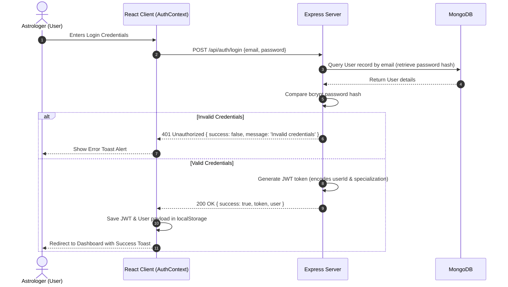
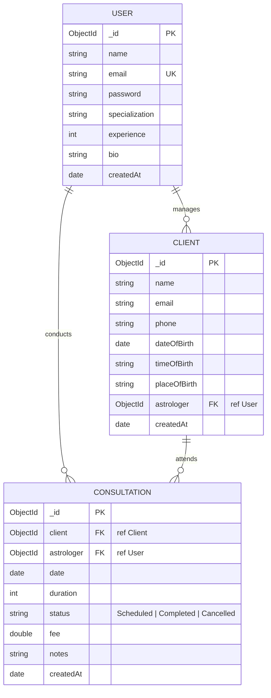

# Aura CRM - System Architecture Documentation

This document describes the architectural layout, data flow patterns, authentication policies, database relations, and deployment topology of Aura CRM.

---

## 🏗 System Architecture Overview

Aura CRM is designed using a decoupled client-server architecture model. The backend is an Express-powered REST API serving JSON structures, and the frontend is a React-based Single Page Application (SPA) compiled via Vite. 

### Architecture Topology Diagram


---

## 🔒 Authentication Flow

Aura CRM implements stateless JWT-based session persistence. Users authenticate using credentials, and the API returns a JWT signature token. The token is stored in the browser's `localStorage` and automatically appended to the `Authorization` header of all subsequent API calls.



---

## 📂 Code Module Organization

The codebase is split into the two primary root subfolders:

### 1. Backend Service (`server/`)
* **`config/`**: Contains MongoDB connection scripts (`db.js`) and custom error class objects (`errorHandler.js`).
* **`controllers/`**: Isolates business-level operations. Express controllers extract parameters, call models, and return standardized JSON.
* **`middleware/`**: Implements global HTTP interceptors:
  * `authMiddleware.js`: Validates JWT header strings and attaches request context (`req.user`).
  * `errorMiddleware.js`: Handles database casting faults, duplicates, Mongoose validation bugs, and token expiry.
* **`models/`**: Defins Mongoose Schemas and pre-save database hook triggers (like automatic bcrypt password hashing).
* **`routes/`**: Handles HTTP request parsing and maps routing paths to authorization rules and controllers.
* **`server.js`**: Application entry point initializing middleware pipelines, routing, static directories, and socket listeners.

### 2. Frontend Application (`client/`)
* **`src/components/ui/`**: Hosts atomic, style-agnostic custom UI tags (`Button`, `Card`, `Input`, `Spinner`).
* **`src/components/`**: Houses modals and context wrappers (e.g. `ClientFormModal`, `Navbar`, `ProtectedRoute`).
* **`src/context/`**: Context Providers managing application state:
  * `AuthContext.jsx`: Manages logging actions, storage sync, profile reloading, and loading layouts.
  * `ToastContext.jsx`: Handles stackable slide-in action notification grids.
* **`src/pages/`**: Single Page Views mapped to routing rules (`Login`, `Signup`, `Dashboard`, `Clients`, `Consultations`, `Analytics`).
* **`src/services/api.js`**: Reusable Axios instance attaching token headers on outgoing requests and intercepting response errors to clear sessions on expired tokens.

---

## 🗄 Database Entity Relationship

Aura CRM utilizes MongoDB to store accounts, client rosters, and scheduled consultations. The data relations are mapped as follows:



---

## 📊 Analytics Aggregation Engine

To generate high-performance metrics without loading large database dumps into client memory, Aura CRM executes native MongoDB Aggregation pipelines. 

### 1. Revenue Progression Pipeline
Groups completed consultations by calendar month, summing up the fees earned over the last 6 months.
```javascript
Consultation.aggregate([
  { $match: { astrologer: astrologerId, status: 'Completed', date: { $gte: sixMonthsAgo } } },
  { $group: { _id: { $dateToString: { format: '%Y-%m', date: '$date' } }, revenue: { $sum: '$fee' } } },
  { $sort: { _id: 1 } }
])
```

### 2. Top Contributing Clients Pipeline
Calculates total spent per client by matching user sessions, resolving user details via `$lookup` join operations, and returning the top 5 spenders.
```javascript
Consultation.aggregate([
  { $match: { astrologer: astrologerId, status: 'Completed' } },
  { $group: { _id: '$client', revenue: { $sum: '$fee' }, sessions: { $sum: 1 } } },
  { $sort: { revenue: -1 } },
  { $limit: 5 },
  { $lookup: { from: 'clients', localField: '_id', foreignField: '_id', as: 'clientInfo' } }
])
```

### 3. Consultation Status Proportions
Aggregates session statuses for all scheduled, completed, and cancelled consultation counts.
```javascript
Consultation.aggregate([
  { $match: { astrologer: astrologerId } },
  { $group: { _id: '$status', count: { $sum: 1 } } }
])
```
